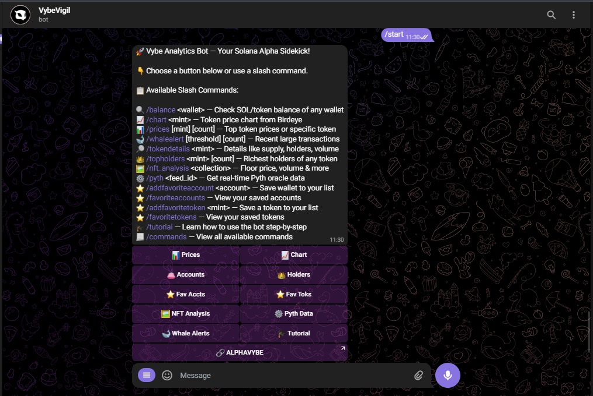

# 🚀 Vybe Analytics Telegram Bot

Vybe Analytics Telegram Bot is a powerful Telegram bot that provides real-time, on-chain insights using Vybe Network APIs. From tracking wallet balances to showing the top token holders and whale alerts, this bot delivers instant analytics to any Telegram user.

## 📝 Project Summary
Vybe Analytics Bot is a Telegram bot that delivers real-time on-chain insights via Vybe APIs. Designed for crypto enthusiasts and traders, it features wallet balance tracking, whale alerts, token price charts, NFT analysis, and deep links to AlphaVybe for advanced analytics. Built with Python and `python-telegram-bot`, it combines multiple Vybe API endpoints into a seamless UX. Key innovations include dynamic parameter handling for commands (e.g., adjustable whale alert thresholds) and direct integration of price charts/NFT ownership visualizations. The bot is commercially deployable today and targets users needing instant, actionable crypto data.

## 🔌 Vybe API Integration
| Command           | Vybe API Endpoint                     | Description                               |
|-------------------|---------------------------------------|-------------------------------------------|
| `/balance`        | `/account/token-balance/{address}`    | Wallet balances and SOL staking data      |
| `/chart`          | `/price/{mint}/token-ohlcv`           | OHLCV data for price charts               |
| `/whalealert`     | `/token/transfers`                    | Whale transfers filtered by USD threshold |
| `/prices`         | `/tokens`                             | Retrieves a list of tracked tokens.       |
| `/tokendetails`   | `/token/{mintAddress}`                | Retrieves details of the specified token. |
| `/topholders`     | `/{mint_address}/top-holders`         | Retrieves the top 1,000 token holders.    |
| `/nft_analysis`   | `/nft/collection-owners/{address}`    | Get the addresses of wallets that own NFT in specified collection.|

## 📌 Features

- 💼 **Wallet Balance**: Check the balance of any Solana wallet.
- 📊 **chart** - Displays the price chart of a specified token.
- 💰 **Token Prices**: Get real-time token price and USD value.
- 🐳 **Whale Alerts**: View the latest large token transfers.
- 📊 **Token Details**: Retrieve full details about any token by its mint address.
- 👑 **Top Token Holders**: View the richest wallets holding a particular token.
- 🤖 **Try The Bot**: [VybeVigil](https://t.me/VybeVigil_bot)
- 🖼 **nft_analysis** - Get NFT collection statistics
<!-- - 🖼️ Token logos and owner logos included for visual context. -->
   ### 🤖 Smart Command Correction
   We all make typos! The bot automatically suggests corrections for common mistakes:
   - `price` → `/prices`
   - `bal` → `/balance`
   - `walealert` → `/whalealert`
   - `nft` → `/nft_analysis`
   - And [50+ other variants](https://github.com/your-repo/blob/main/bot.py#L123-L150)

   **Example Interaction:**  
      ```
      User:  pric solana
      Bot:   ❓ Did you mean /prices?
            Try: `/prices <token_mint> [count]`
            
      User:  whal
      Bot:   ❓ Did you mean /whalealert?
            Try: `/whalealert [threshold] [limit]`
      ```

   ### Why This Matters
   - 🛡️ **Prevents Frustration**: No more silent failures for typos
   - 🧠 **Context-Aware**: Understands 50+ common misspellings
   - 🚀 **Instant Help**: Suggests correct syntax immediately

## 🛠️ Installation

1. Clone the repo:

```bash
git clone https://github.com/your-username/vybe-telegram-bot.git
cd vybe-telegram-bot
```

2. Install the dependencies:

```bash
pip install -r requirements.txt
```

3. Add your credentials:
   - Participants must [contact @EricVybe on Telegram](https://t.me/ericvybes) to request a free API key for the challenge.
   <!-- - Get a **Vybe API key** from [Vbenetwork](https://docs.vybenetwork.com/docs/getting-started). -->
   - Get a **Telegram Bot Token** from [@BotFather](https://t.me/BotFather).
   - Store these in a `.env` file or your preferred config method.
   ```
   VYBE_API_KEY=your_api_key
   TELEGRAM_BOT_TOKEN=your_bot_token
   ```

4. Run the bot:

```bash
python bot.py
```

## 🤖 Bot Commands  

| Command               | Parameters                              | Description                                                                 | Example                                                                 |
|-----------------------|-----------------------------------------|-----------------------------------------------------------------------------|-------------------------------------------------------------------------|
| `/start`              | None                                    | Show introductory message and available commands                           | `/start`                                                               |
| `/balance`            | `<wallet_address>`                      | Get SOL balance and token holdings for a wallet                            | `/balance 4DDUJ1rA3Vk...`                                              |
| `/prices`             | `[token_mint] [count]`                  | Get token prices (specific token or top list)                              | `/prices`<br>`/prices EPjFWdd5AufqSSqeM2qN1xzybapC8G4wEGGkZwyTDt1v 15` |
| `/whalealert`         | `[threshold] [limit]`                   | Show large transfers (default: >$1000, max 7)                              | `/whalealert`<br>`/whalealert 500 3`                                   |
| `/tokendetails`       | `<mint_address>`                        | Get metadata and stats for a token                                         | `/tokendetails EPjFWdd5AufqSSqeM2qN1xzybapC8G4wEGGkZwyTDt1v`           |
| `/topholders`         | `<mint_address> [count]`                | Show top holders of a token (default: top 10)                              | `/topholders EPjFWdd5AufqSSqeM2qN1xzybapC8G4wEGGkZwyTDt1v 5`           |
| 📊 `/chart`           | `<mint_address>`                        | Display price chart for a token (last 30 days)                             | `/chart EPjFWdd5AufqSSqeM2qN1xzybapC8G4wEGGkZwyTDt1v`                  |
| 🖼 `/nft_analysis`    | `<collection_address>`                  | Analyze NFT collection ownership distribution                              | `/nft_analysis 7VQo9H...`                                              |

**Syntax Guide**:  
- `<required>`: Replace with actual value (e.g., `<wallet_address>`).  
- `[optional]`: Optional arguments (e.g., `[count]`).  
- Examples use shortened addresses for readability. Full addresses work in the bot.

## 🧠 How It Works

- Uses Vybe API endpoints like `/balance`, `/price`, `/chart`, `/token-details`, `/top-holders`, and `/whale-alert`.
- Formats block time into human-readable format using Python's datetime.
- Uses `python-telegram-bot` for asynchronous, user-friendly bot behavior.
<!-- - Token logos and owner logos are embedded via direct URL (Telegram supports image previews). -->

## 📷 Screenshots

| START |
|-------|
|  |

| Whale Alerts | Top Holders |
|--------------|-------------|
|  |  |
| chart | Token Details |
|  |  |


## 💡 Innovation Highlights

   - Combines several endpoints into a compact UX.
   - Displays both raw data and formatted insights.
   - Designed for real-world, commercial-ready use.
   - Uses Vybe APIs for actionable, real-time crypto insights, linking users to AlphaVybe for deeper analytics.
   ### 🚀 Commercial Readiness
      - Built for scalability with asynchronous API calls and error handling.
      - Supports deep links to AlphaVybe for monetizable user journeys (e.g., premium analytics).
      - Modular design allows easy addition of new Vybe API endpoints.

## 🏁 Getting Your Vybe API Key

Visit [Vybenetwork](https://docs.vybenetwork.com/docs/getting-started) read the instructions and get your **API key**.

## 📜 License

MIT License - free to use and modify. See `LICENSE` file for details.

<!-- ## 📬 Submit Your Entry

- Publish your repo with an open-source license
- Include a 200-word project summary in your submission
- Provide the deployed Telegram bot link
- Make sure the README is complete and clear

--- -->

Made with 💙 by [Kosisochukwu](https://kosisochukwu.onrender.com) using [Vybe Network](https://vybenetwork.xyz)
